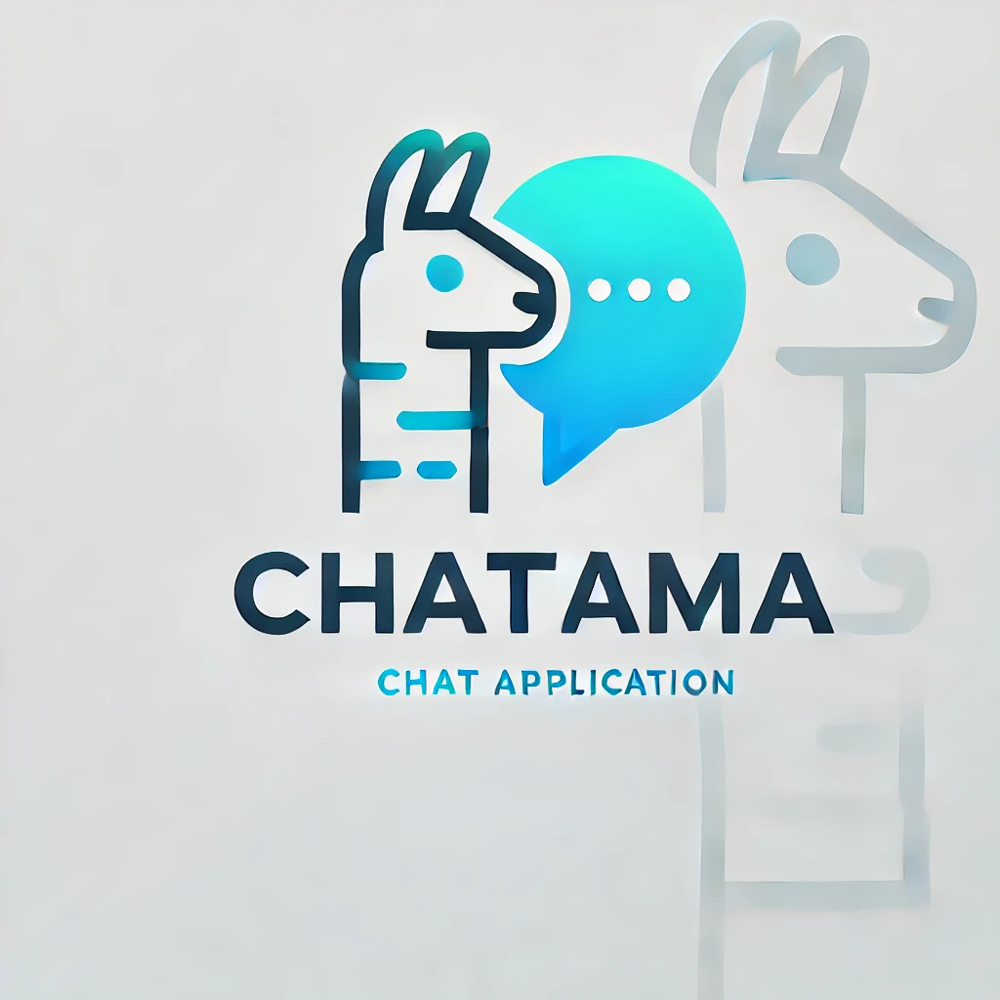

<p align="center">
  
</p>

<h1 align="center">Chattama</h1>

A modern chat interface for Ollama with support for multiple models, image analysis, chat organization, and dark mode.

## Features

### Chat Management
- Create and manage multiple chat sessions
- Organize chats into collections
- Drag and drop chats between collections
- Edit chat and collection names
- Clear chat history
- Persistent storage of chats and settings

### Model Support
- Switch between different Ollama models
- Support for vision models (e.g., llava)
- Visual indicator for vision-capable models
- Persistent model selection per chat

### Image Analysis
- Drag and drop images into chat
- Paste images from clipboard
- Multiple image support per message
- Compatible with vision models

### User Interface
- Dark/Light mode support
- Responsive design
- Keyboard shortcuts
- Message timestamps
- Custom color themes for user/assistant messages
- Smooth animations and transitions

### Collections
- Create collections to organize chats
- Drag and drop to reorder collections
- Move chats between collections
- Empty state indicators
- Collapsible collection view

### Settings
- Dark/Light mode toggle
- Send on Enter/Shift+Enter option
- Show/Hide timestamps
- Customize message colors
- Settings persist across sessions

## Data Storage

Chattama uses browser localStorage to persist data:

### Stored Data
- Chat history and messages
- Collections and their order
- Active chat selection
- Selected model per chat
- UI settings and preferences
- Message timestamps

### Storage Location
- All data is stored in your browser's localStorage
- Data persists across browser sessions
- Data is stored per-domain
- No server-side storage or cloud sync
- Data remains local to your device

### Storage Limits
- localStorage typically has a 5-10MB limit
- Large chat histories may need periodic cleanup
- Images are not stored (only processed for sending)
- Consider exporting important chats if approaching limits

### Data Privacy
- All data stays on your device
- No data is sent to external servers
- Only communicates with local Ollama instance
- Chat history is private to your browser

## Prerequisites

1. Install [Ollama](https://ollama.ai)
2. Pull a model (e.g., for vision support):
   ```bash
   ollama pull llava
   ```

## Installation

1. Clone the repository:
   ```bash
   git clone [repository-url]
   cd chattama
   ```

2. Install dependencies:
   ```bash
   npm install
   ```

3. Start the development server:
   ```bash
   npm run dev
   ```

4. Open [http://localhost:5173](http://localhost:5173) in your browser

## Usage

### Basic Chat
1. Click "New Chat" to start a conversation
2. Select a model from the dropdown
3. Type your message and press Enter (or click Send)
4. Clear chat history using the "Clear Chat" button

### Image Analysis
1. Select a vision-capable model (marked with Vision badge)
2. Drag and drop images into the chat
3. Or paste images from clipboard (Ctrl/Cmd + V)
4. Add text description if desired
5. Send to analyze the images

### Chat Organization
1. Create collections using the "Collection" button
2. Drag chats into collections
3. Rename collections by clicking the edit icon
4. Reorder collections by dragging
5. Delete collections with the trash icon (chats move to root)

### Keyboard Shortcuts
- Send message: Enter (configurable)
- New line: Shift + Enter
- Cancel generation: Escape
- Paste image: Ctrl/Cmd + V

### Settings
Access settings through the gear icon:

1. Appearance
   - Dark/Light mode toggle
   - User message color
   - Assistant message color

2. Behavior
   - Send on Enter toggle
   - Show timestamps toggle

## Development

### Project Structure
```
chattama/
├── src/
│   ├── components/
│   │   ├── App.jsx              # Main application component
│   │   ├── ChatContainer.jsx    # Chat interface container
│   │   ├── ChatList.jsx         # Chat/Collection sidebar
│   │   ├── MessageInput.jsx     # Message input with image support
│   │   ├── MessageList.jsx      # Message display
│   │   ├── ModelSelector.jsx    # Model selection dropdown
│   │   └── Settings.jsx         # Settings modal
│   ├── utils/
│   │   └── modelUtils.js        # Model utility functions
│   └── main.jsx                 # Application entry point
```

### Technologies
- React
- Vite
- Emotion (styled components)
- LocalStorage for persistence
- Ollama API integration

## Troubleshooting

### Common Issues

1. "Error loading models"
   - Ensure Ollama is running
   - Check if Ollama API is accessible (default: http://localhost:11434)

2. "No models found"
   - Pull at least one model: `ollama pull llava`
   - Check Ollama model list: `ollama list`

3. Image analysis not working
   - Ensure you're using a vision-capable model (e.g., llava)
   - Check image file format (supported: PNG, JPEG, WebP)
   - Verify image size is reasonable

4. Chat history lost
   - Check if localStorage is enabled in your browser
   - Ensure sufficient storage space
   - Try clearing browser cache
   - Check browser's localStorage limits
   - Consider exporting important chats

### Data Recovery
If chat history is lost:
1. Check browser's localStorage settings
2. Verify site permissions
3. Check for storage quota issues
4. Ensure private browsing is disabled
5. Consider regular chat exports for backup

## Contributing

Contributions are welcome! Please feel free to submit a Pull Request.
